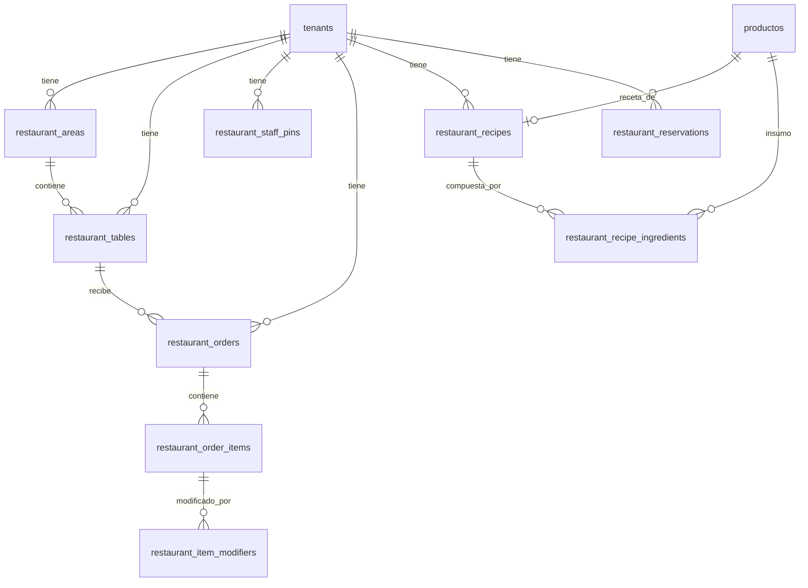
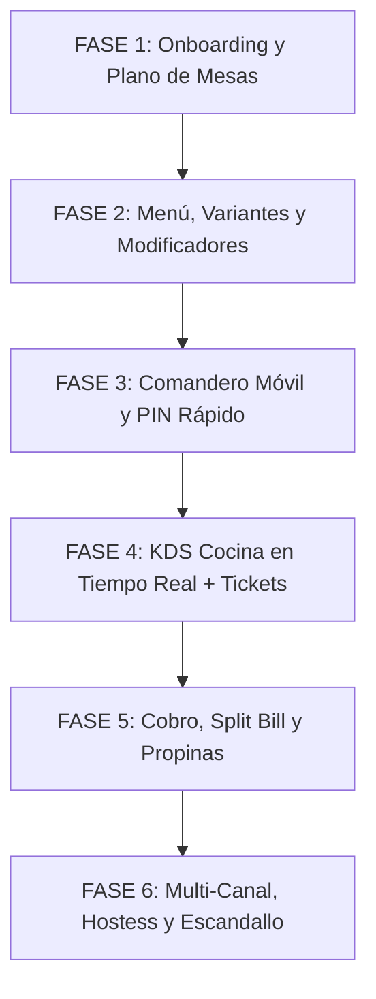

# 🍽️ SYMVORA Restaurant — Plan Maestro de Arquitectura e Implementación por Fases

> **Documento de Especificación y Hoja de Ruta de Producto**  
> **Versión:** 1.0  
> **Fecha:** Septiembre 2026  
> **Estado:** Aprobado para Planificación e Implementación Gradual  
> **Ubicación:** `.agents/PLANEACION SISTEMA RESTAURANTE SYMVORA.md`

---

## 📑 Tabla de Contenidos

1. [Visión General y Filosofía de Producto](#1-visión-general-y-filosofía-de-producto)
2. [Bifurcación en Onboarding y Registro](#2-bifurcación-en-onboarding-y-registro)
3. [Estructura de Roles y Autenticación de Piso (PIN Rápido)](#3-estructura-de-roles-y-autenticación-de-piso-pin-rápido)
4. [Módulos Operativos y Flujos de Trabajo](#4-módulos-operativos-y-flujos-de-trabajo)
   - [4.1 Plano de Salones y Gestión de Mesas](#41-plano-de-salones-y-gestión-de-mesas)
   - [4.2 Comandero Móvil Táctil (Meseros)](#42-comandero-móvil-táctil-meseros)
   - [4.3 Sistema de Cocina y Barra (KDS Digital + Impresión Dual)](#43-sistema-de-cocina-y-barra-kds-digital--impresión-dual)
   - [4.4 Canales de Venta Multi-Servicio (Comedor, Para Llevar, Delivery Propio y Apps)](#44-canales-de-venta-multi-servicio-comedor-para-llevar-delivery-propio-y-apps)
   - [4.5 Cobro, División de Cuentas (Split Bill) y Propinas](#45-cobro-división-de-cuentas-split-bill-y-propinas)
   - [4.6 Hostess, Reservaciones y Lista de Espera](#46-hostess-reservaciones-y-lista-de-espera)
   - [4.7 Inventario Gastronómico y Escandallo de Recetas](#47-inventario-gastronómico-y-escandallo-de-recetas)
5. [Modelo de Datos y Extensiones de Base de Datos (Supabase Postgres)](#5-modelo-de-datos-y-extensiones-de-base-de-datos-supabase-postgres)
6. [Hoja de Ruta de Implementación por Fases](#6-hoja-de-ruta-de-implementación-por-fases)
7. [Consideraciones de Rendimiento, Resiliencia y Hardware](#7-consideraciones-de-rendimiento-resiliencia-y-hardware)

---

## 1. Visión General y Filosofía de Producto

Inspirado en la división modular que ofrecen plataformas líderes como Mercado Pago / Mercado Libre y Toast POS, **SYMVORA** evoluciona para soportar dos modalidades de negocio claramente diferenciadas desde el alta de cuenta:

1. **Punto de Venta Clásico (Retail / Comercio):**  
   Optimizado para tiendas de abarrotes, farmacias, ferreterías, tiendas de ropa y retail general, con lectura intensiva de códigos de barras, gestión de lotes, control de stock directo y caja tradicional.
2. **Sistema para Restaurantes (Alimentos y Bebidas):**  
   Diseñado específicamente para el dinamismo de la industria gastronómica: restaurantes de servicio completo, bares, cafeterías, taquerías, pizzerías y *dark kitchens*. Integra plano visual de mesas, toma de comandas móviles en mesa, pantallas KDS en tiempo real para cocina/barra, modificadores de platillos, división de cuentas, propinas y costeo por recetas.

### Principio de Experiencia de Usuario: Entornos 100% Independientes
- La experiencia visual, la navegación del menú lateral (`sidebar`), el dashboard de bienvenida y los flujos operativos se adaptan completamente según el tipo de sistema seleccionado.
- Un usuario restaurantero no verá campos irrelevantes como códigos de barras obligatorios o stock de góndola en su pantalla diaria; en su lugar verá salones, comandas activas, tiempos de preparación y mesas ocupadas.
- **Reutilización transversal de infraestructura:** Ambos sistemas comparten de forma transparente la autenticación multi-tenant de Supabase, las suscripciones, la facturación electrónica SAT (CFDI 4.0), las terminales de cobro (Mercado Pago Point / Conekta), la reportería financiera y los cortes de caja.

---

## 2. Bifurcación en Onboarding y Registro

### 2.1 Flujo de Selección Inicial
En el proceso de registro (`/signup`), el asistente de incorporación agrega un paso visual primordial antes de configurar el negocio:

```
[ Registro de Usuario ] 
           │
           ▼
[ ¿Qué tipo de sistema necesitas? ]
    ├── [ Opción A: Comercio / Punto de Venta Retail ]
    │      └── Abarrotes, Ferretería, Farmacia, Ropa, Boutique, Tienda General.
    └── [ Opción B: Restaurante / Alimentos y Bebidas ]
           └── Restaurante, Bar, Cafetería, Taquería, Pizzería, Comida Rápida.
```

### 2.2 Atributos del Tenant
- Se agrega el campo `tipo_sistema` con valor `'RETAIL' | 'RESTAURANTE'` (almacenado en la tabla `tenants` y propagado en `tenant_settings.configuracion_json`).
- En la función de base de datos `complete_onboarding`:
  - Si `tipo_sistema = 'RESTAURANTE'`, se configuran por defecto los módulos activos correspondientes (`mesas`, `comandas`, `kds`, `turnos`, `recetas`, `propinas`).
  - Se crean áreas y mesas iniciales de ejemplo (p. ej. *Salón Principal*, Mesas 1 a 6) para que el nuevo negocio pueda probar el sistema de inmediato sin pantallas vacías.

### 2.3 Navegación Dinámica (`src/lib/navigation.ts`)
El sidebar detecta el `tipo_sistema` del tenant actual y renderiza el menú adaptado:

| Ruta Restaurante | Etiqueta | Icono | Rol / Permiso Requerido |
| :--- | :--- | :--- | :--- |
| `/restaurant/dashboard` | Tablero Gastronómico | `LayoutDashboard` | `sales.view_reports` |
| `/restaurant/tables` | Mapa de Mesas y Salones | `UtensilsCrossed` | `restaurant.tables` |
| `/restaurant/waiter` | Comandero Móvil | `TabletSmartphone` | `restaurant.orders` |
| `/restaurant/kds` | Pantalla de Cocina / KDS | `ChefHat` | `restaurant.kds` |
| `/restaurant/hostess` | Hostess y Reservaciones | `BookOpenCheck` | `restaurant.hostess` |
| `/restaurant/delivery` | Despacho y Delivery | `Bike` | `restaurant.delivery` |
| `/restaurant/menu` | Menú, Platillos y Recetas | `MenuSquare` | `inventory.manage` |
| `/finances` | Caja, Turnos y Propinas | `Wallet` | `cash.manage` |
| `/restaurant/reports` | Reportes Gastronómicos | `TrendingUp` | `sales.view_reports` |
| `/settings` | Configuración del Local | `Settings` | `org.manage_settings` |

---

## 3. Estructura de Roles y Autenticación de Piso (PIN Rápido)

En la dinámica de un restaurante es inviable que cada mesero o cocinero cierre e inicie sesión con correo electrónico y contraseña compleja en una tablet compartida para tomar un pedido. Por ello, se implementa una arquitectura híbrida:

### 3.1 Niveles de Acceso

```
[ SUPER_ADMIN / Dueño ] ──── Login con Email + Contraseña / OAuth
       │
[ ORG_ADMIN / Gerente ] ──── Login con Email + Contraseña / OAuth
       │
  (Habilitan Modo Terminal / Piso en Tablets y Pantallas)
       │
       ├── [ CAPITÁN DE MESEROS ] ─── PIN de 4 dígitos (Reasigna mesas, autoriza descuentos/cancelaciones)
       ├── [ MESERO ] ─────────────── PIN de 4 dígitos (Apertura de mesa, toma de comanda, precierre)
       ├── [ COCINERO / BARRA ] ───── PIN o Estación Fija KDS (Manejo de tiempos de preparación)
       ├── [ HOSTESS ] ────────────── PIN de 4 dígitos (Recepción, lista de espera y reservas)
       ├── [ REPARTIDOR ] ─────────── PIN de 4 dígitos (Asignación de ruta y liquidación)
       └── [ CAJERO ] ─────────────── PIN de 4 dígitos (Cobro de comanda, división y propinas)
```

### 3.2 Modalidad "Terminal de Piso" (Fast Switcher)
1. El gerente inicia sesión en el dispositivo de la estación (tablet, iPad o terminal táctil All-in-One).
2. El sistema entra en **Modo Piso de Restaurante**: una pantalla de bloqueo elegante muestra la cuadrícula numérica de PIN y los avatares/nombres de los meseros de turno.
3. El mesero digita su PIN de 4 dígitos: el sistema cambia el contexto activo instantáneamente en memoria local, permitiéndole enviar pedidos a su nombre.
4. Tras 30 segundos de inactividad o al pulsar el botón "Terminar Comanda", la pantalla regresa al teclado de PIN para el siguiente compañero.

### 3.3 Tabla de Seguridad: `restaurant_staff_pins`
- Cada PIN se almacena cifrado (`bcrypt` o `pgcrypto.crypt`) asociado al `tenant_id` y al `user_id` o `staff_id`.
- Se incluye un límite de 5 intentos fallidos consecutivos antes de un bloqueo temporal de 2 minutos para evitar ataques por fuerza bruta.

---

## 4. Módulos Operativos y Flujos de Trabajo

### 4.1 Plano de Salones y Gestión de Mesas
- **Zonificación por Áreas:** Salón Principal, Terraza, Barra, Zona VIP, Planta Alta, Jardín.
- **Diseño Visual:** Cuadrícula con mesas circulares y cuadradas personalizables en posición y capacidad de comensales (2, 4, 6, 8 personas).
- **Semáforo de Estados en Tiempo Real (Supabase Realtime):**
  - 🟢 **Libre:** Mesa limpia disponible para asignar.
  - 🔵 **Ocupada:** Clientes sentados con comanda en curso.
  - 🟡 **En Preparación:** Pedido enviado a cocina/barra pendiente de entrega.
  - 🟣 **Comiendo / Servido:** Todos los tiempos han sido entregados a la mesa.
  - 🔴 **Cuenta Solicitada (Precierre):** El comensal pidió la cuenta; la mesa está por liberarse.
  - ⚪ **En Limpieza / Sucia:** Clientes se retiraron; requiere liberación por hostess o mesero.
- **Funciones de Gestión de Mesa:**
  - Juntar mesas (p. ej. Mesa 4 + Mesa 5 para grupo grande).
  - Transferir comanda de una mesa a otra (si el cliente se cambia a la terraza).
  - Reasignar mesa a otro mesero por cambio de turno.

---

### 4.2 Comandero Móvil Táctil (Meseros)
Desarrollado con filosofía **PWA Mobile-First / Zero-Install**: no requiere publicar en App Store ni Play Store; los meseros acceden desde cualquier smartphone o tablet conectada al WiFi local.

- **Diseño a una mano:** Botonera ergonómica inferior, teclado táctil numérico amplio, categorías de menú horizontales de acceso ultra-rápido.
- **Gestión por Sillas / Comensales:**
  - Posibilidad de ordenar por comensal (`Comensal 1`, `Comensal 2`, `Comensal 3`) o comanda general compartida (al centro).
  - Facilita la división de cuentas posterior sin discusiones.
- **Modificadores y Variantes:**
  - **Variantes:** Tamaño (Chico, Mediano, Grande), Tipo de Pan, Término de la carne (Término medio, 3/4, Bien cocido).
  - **Modificadores Obligatorios:** Elección de guarnición (Papas a la francesa o Ensalada fresca).
  - **Modificadores Opcionales y Agregados:** Con cargo extra (+$25 tocino, +$20 queso extra) o exclusiones ("Sin cebolla", "Sin mayonesa").
  - **Notas Especiales de Cocina:** Campo de texto rápido ("Alérgico a los mariscos", "Salsa aparte").
- **Tiempos de Servicio:**
  - Clasificación de platillos en `Entrada`, `Plato Fuerte`, `Postre`, `Bebida`.
  - Botón "Marchar Plato Fuerte": Notifica a cocina que los comensales terminaron la entrada y pueden comenzar a emplatar el segundo tiempo.

---

### 4.3 Sistema de Cocina y Barra (KDS Digital + Impresión Dual)

```
[ Comandero Móvil ] 
         │ (Disparo de Comanda)
         ▼
[ Supabase Realtime WebSocket ]
         ├──► [ Pantalla KDS Cocina Caliente ] (Parrilla, Freidoras)
         ├──► [ Pantalla KDS Cocina Fría ]     (Ensaladas, Entradas)
         ├──► [ Pantalla KDS Barra / Bebidas ] (Coctelería, Cafés, Cervezas)
         └──► [ Impresoras Térmicas ESC/POS ]  (Tickets de comanda física opcional)
```

#### Pantalla KDS (Kitchen Display System)
- Interfaz de alto contraste en modo oscuro diseñada para pantallas táctiles de 15" a 32" o Smart TVs en cocina.
- **Tarjetas de Comanda Dinámicas:**
  - Número de mesa / canal (Mesa 5, Para Llevar #102, UberEats #48).
  - Nombre del mesero y número de comensales.
  - Tiempo transcurrido con alerta cromática:
    - 🟢 Menos de 10 min.
    - 🟡 Entre 10 y 20 min.
    - 🔴 Más de 20 min (parpadeo visual de retraso).
  - Detalle claro de modificaciones en color distintivo (ej. texto rojo para "SIN CEBOLLA", naranja para "TÉRMINO 3/4").
- **Interacción Táctil:**
  - Tocar platillo individual para marcarlo "Listo".
  - Tocar encabezado para marcar la comanda completa "Terminada".
  - Sonido auditivo personalizable cuando ingresa una nueva orden ("Campana" o "Chime").
- **Aviso al Mesero:**
  - Cuando cocina marca un platillo como "Listo", el dispositivo del mesero emite una vibración/notificación push: *"Mesa 4: Bebidas listas en barra"*.

#### Soporte de Impresión Dual (Térmica ESC/POS)
- Integración para negocios que prefieren el ticket físico de cocina pegado en la campana de preparación.
- Enrutamiento por impresora de red (LAN Ethernet / WiFi) según categoría de producto:
  - Impresora 1 (IP `192.168.1.200`): Cocina.
  - Impresora 2 (IP `192.168.1.201`): Barra de bebidas.

---

### 4.4 Canales de Venta Multi-Servicio
El restaurante gestiona 4 modalidades dentro de una misma interfaz unificada:

1. **Comedor (Dine-in):** Control por mesa, comensales, mesero y tiempos.
2. **Para Llevar (Takeout / Mostrador):**
   - No requiere mesa; se asigna nombre de cliente y número correlativo de ticket.
   - Cobro por adelantado en caja o contra entrega.
   - Pantalla o llamado por número de orden cuando cocina lo despacha.
3. **Delivery Propio (Reparto a Domicilio):**
   - Registro de cliente con teléfono, dirección y referencias de entrega.
   - Asignación a repartidor del equipo con tracking de estatus (`Asignado`, `En Camino`, `Entregado`).
   - Liquidación de cuentas: reporte de cuánto efectivo debe entregar cada repartidor al volver a caja.
4. **Pedidos de Plataformas Externas (Uber Eats, Rappi, DiDi Food):**
   - Entrada manual ágil desde la pantalla de pedidos.
   - Se captura el ID de orden de la app externa y el método de pago (`UBER_EATS`, `RAPPI`, etc.).
   - La orden se envía directo a KDS para cocina y descuenta insumos de inventario, evitando discrepancias en el corte contable sin mezclar el dinero con la caja física.

---

### 4.5 Cobro, División de Cuentas (Split Bill) y Propinas

#### Pre-cuenta (Ticket Informativo)
- El mesero imprime o muestra en la tablet la pre-cuenta desglosada para que los comensales revisen su consumo antes de emitir el cobro final.

#### División de Cuentas Avanzada (Split Bill)
El sistema permite 3 modalidades de división:
1. **Por Partes Iguales:** El total se divide automáticamente entre $N$ personas (ej. Cuenta de $1,200 entre 4 = $300 c/u).
2. **Por Comensal / Silla:** Cada comensal paga exclusivamente lo que consumió según el registro de sillas del comandero.
3. **División Manual / Itemizada:** El cajero o mesero arrastra platillos específicos a una sub-cuenta individual (ej. "La botella de vino se divide entre 2 personas, y cada quien paga su plato fuerte").

#### Gestión y Distribución de Propinas (Tips)
- **Sugerencia en Pantalla y Ticket:** Botones rápidos de propina sugerida (10%, 15%, 20% o monto personalizado).
- **Separación Contable:** La propina no suma al ingreso gravable de ventas ni afecta el IVA del negocio.
- **Pool de Propinas (Corte de Turno):**
  - Registro de propinas en efectivo vs. propinas cobradas con tarjeta (Point / Terminal).
  - Cálculo de distribución configurable (ej. 70% meseros, 20% cocina, 10% barra).
  - Reporte de liquidación al cierre de caja para entrega transparente al personal.

---

### 4.6 Hostess, Reservaciones y Lista de Espera

- **Lista de Espera en Vivo:**
  - Registro ágil: Nombre, teléfono, número de personas y solicitud especial (ej. "Silla periquera para bebé", "Mesa exterior").
  - Cálculo de tiempo estimado según rotación promedio de mesas ocupadas.
  - Alerta visual cuando una mesa con la capacidad requerida se libera.
- **Libro de Reservaciones Digital:**
  - Calendario con vista por turnos: Desayuno, Comida, Cena.
  - Estados de reserva: `Pendiente`, `Confirmada`, `Cliente Sentado`, `No Show`, `Cancelada`.
- **Control de Aforo en Vivo:**
  - Indicador porcentual de ocupación del local y por áreas específicas.

---

### 4.7 Inventario Gastronómico y Escandallo de Recetas

A diferencia del retail, en un restaurante se venden platillos compuestos de insumos base que sufren mermas durante la preparación:

```
[ Platillo: Hamburguesa Clásica ] ($180.00 MXN)
       │
       ├── Insumo: Carne molida de res ───── 180 gr (Costo: $28.00)
       ├── Insumo: Pan brioche artesanal ── 1 pza   (Costo: $8.50)
       ├── Insumo: Queso cheddar ────────── 40 gr  (Costo: $6.00)
       ├── Insumo: Tocino ahumado ───────── 30 gr  (Costo: $7.20)
       ├── Insumo: Jitomate bola ────────── 50 gr  (Costo: $1.80)
       └── Insumo: Papas corte francés ──── 150 gr (Costo: $5.50)
                                            ──────────────────────
                                            Costo Teórico: $57.00
                                            Margen Bruto:  68.3%
```

- **Ficha Técnica / Escandallo:**
  - Definición de insumos primarios con unidades métricas exactas (gramos, kilogramos, mililitros, litros, piezas).
  - Factor de merma porcentual (ej. merma en cocción de la carne o corte de vegetales).
- **Explosión de Insumos Automática:**
  - Al despachar o cobrar una comanda, el motor de base de datos descuenta las porciones de insumos correspondientes.
  - Soporte para modificadores: si el cliente pidió *"Extra Queso"*, se descuentan 40 gr adicionales; si pidió *"Sin Cebolla"*, no se deduce dicho insumo.
- **Alertas de Stock Crítico en Cocina:**
  - Notificación en tiempo real al capitán y cocina cuando un insumo base se agota, marcando el platillo automáticamente como *"Agotado / Fuera de Menú"* en el comandero de los meseros para evitar órdenes que no se pueden preparar.

---

## 5. Modelo de Datos y Extensiones de Base de Datos (Supabase Postgres)

A continuación se detalla la propuesta de esquema relacional compatible con el estándar multi-tenant y RLS de SYMVORA:



### 5.1 Nuevos Enums en Postgres
```sql
-- Estado general de una comanda o pedido gastronómico
CREATE TYPE public.restaurant_order_status AS ENUM (
  'ABIERTA',
  'EN_PREPARACION',
  'LISTA',
  'ENTREGADA',
  'PRECIERRE',
  'COBRADA',
  'CANCELADA'
);

-- Estado de cada platillo dentro de la comanda en cocina
CREATE TYPE public.restaurant_item_status AS ENUM (
  'RECIBIDO',
  'EN_PREPARACION',
  'LISTO',
  'ENTREGADO',
  'CANCELADO'
);

-- Canales de venta del restaurante
CREATE TYPE public.restaurant_order_channel AS ENUM (
  'COMEDOR',
  'PARA_LLEVAR',
  'DELIVERY_PROPIO',
  'UBER_EATS',
  'RAPPI',
  'DIDI_FOOD'
);

-- Estados de una mesa en piso
CREATE TYPE public.restaurant_table_status AS ENUM (
  'LIBRE',
  'OCUPADA',
  'CUENTA_PEDIDA',
  'SUCIA_LIMPIEZA',
  'RESERVADA',
  'BLOQUEADA'
);
```

### 5.2 Tablas Principales Propuestas

#### 1. Áreas y Salones (`restaurant_areas`)
```sql
CREATE TABLE public.restaurant_areas (
  id UUID PRIMARY KEY DEFAULT gen_random_uuid(),
  tenant_id UUID NOT NULL REFERENCES public.tenants(id) ON DELETE CASCADE,
  nombre TEXT NOT NULL, -- "Salón Principal", "Terraza", "Barra"
  orden INT NOT NULL DEFAULT 0,
  activa BOOLEAN NOT NULL DEFAULT TRUE,
  creado_en TIMESTAMPTZ NOT NULL DEFAULT NOW()
);
```

#### 2. Mesas del Local (`restaurant_tables`)
```sql
CREATE TABLE public.restaurant_tables (
  id UUID PRIMARY KEY DEFAULT gen_random_uuid(),
  tenant_id UUID NOT NULL REFERENCES public.tenants(id) ON DELETE CASCADE,
  area_id UUID NOT NULL REFERENCES public.restaurant_areas(id) ON DELETE CASCADE,
  numero TEXT NOT NULL, -- "Mesa 1", "M-14", "Barra 3"
  capacidad INT NOT NULL DEFAULT 4,
  estado restaurant_table_status NOT NULL DEFAULT 'LIBRE',
  posicion_x INT NOT NULL DEFAULT 0, -- Coordenadas en el mapa visual
  posicion_y INT NOT NULL DEFAULT 0,
  comanda_activa_id UUID, -- Referencia a la orden activa abierta
  mesero_activo_id UUID,  -- Mesero que tiene abierta la comanda
  actualizado_en TIMESTAMPTZ NOT NULL DEFAULT NOW()
);
```

#### 3. PINs de Personal de Piso (`restaurant_staff_pins`)
```sql
CREATE TABLE public.restaurant_staff_pins (
  id UUID PRIMARY KEY DEFAULT gen_random_uuid(),
  tenant_id UUID NOT NULL REFERENCES public.tenants(id) ON DELETE CASCADE,
  nombre TEXT NOT NULL, -- Nombre a mostrar en pantalla del mesero/cocinero
  puesto TEXT NOT NULL, -- "CAPITAN", "MESERO", "COCINA", "HOSTESS", "REPARTIDOR"
  pin_hash TEXT NOT NULL, -- Cifrado con pgcrypto / bcrypt
  color_avatar TEXT DEFAULT '#3b82f6',
  activo BOOLEAN NOT NULL DEFAULT TRUE,
  intentos_fallidos INT NOT NULL DEFAULT 0,
  bloqueado_hasta TIMESTAMPTZ,
  creado_en TIMESTAMPTZ NOT NULL DEFAULT NOW()
);
```

#### 4. Comandas y Órdenes (`restaurant_orders`)
```sql
CREATE TABLE public.restaurant_orders (
  id UUID PRIMARY KEY DEFAULT gen_random_uuid(),
  tenant_id UUID NOT NULL REFERENCES public.tenants(id) ON DELETE CASCADE,
  folio_diario INT NOT NULL, -- Folio secuencial reiniciado cada día (Orden #1, #2...)
  canal restaurant_order_channel NOT NULL DEFAULT 'COMEDOR',
  mesa_id UUID REFERENCES public.restaurant_tables(id) ON DELETE SET NULL,
  mesero_id UUID REFERENCES public.restaurant_staff_pins(id),
  repartidor_id UUID REFERENCES public.restaurant_staff_pins(id),
  cliente_nombre TEXT, -- Para llevar o delivery
  cliente_telefono TEXT,
  direccion_entrega TEXT,
  notas_generales TEXT,
  num_comensales INT NOT NULL DEFAULT 1,
  estado restaurant_order_status NOT NULL DEFAULT 'ABIERTA',
  
  -- Totales
  subtotal DECIMAL(12,2) NOT NULL DEFAULT 0,
  descuento DECIMAL(12,2) NOT NULL DEFAULT 0,
  total DECIMAL(12,2) NOT NULL DEFAULT 0,
  propina_sugerida DECIMAL(12,2) NOT NULL DEFAULT 0,
  propina_pagada DECIMAL(12,2) NOT NULL DEFAULT 0,
  
  -- Auditoría y tiempos
  abierta_en TIMESTAMPTZ NOT NULL DEFAULT NOW(),
  cocina_lista_en TIMESTAMPTZ,
  cerrada_en TIMESTAMPTZ
);
```

#### 5. Platillos de la Comanda (`restaurant_order_items`)
```sql
CREATE TABLE public.restaurant_order_items (
  id UUID PRIMARY KEY DEFAULT gen_random_uuid(),
  tenant_id UUID NOT NULL REFERENCES public.tenants(id) ON DELETE CASCADE,
  order_id UUID NOT NULL REFERENCES public.restaurant_orders(id) ON DELETE CASCADE,
  producto_id UUID NOT NULL REFERENCES public.productos(id),
  nombre_platillo TEXT NOT NULL,
  comensal_num INT NOT NULL DEFAULT 1, -- Silla o comensal
  tiempo_servicio TEXT DEFAULT 'PRINCIPAL', -- 'ENTRADA', 'PRINCIPAL', 'POSTRE', 'BEBIDA'
  cantidad INT NOT NULL DEFAULT 1,
  precio_unitario DECIMAL(10,2) NOT NULL DEFAULT 0,
  precio_total DECIMAL(10,2) NOT NULL DEFAULT 0,
  notas_cocina TEXT, -- "Término medio, salsa aparte"
  estado restaurant_item_status NOT NULL DEFAULT 'RECIBIDO',
  estacion_preparacion TEXT DEFAULT 'COCINA', -- 'COCINA', 'BARRA', 'PARRILLA', 'POSTRES'
  
  enviado_cocina_en TIMESTAMPTZ NOT NULL DEFAULT NOW(),
  listo_en TIMESTAMPTZ
);
```

#### 6. Modificadores y Agregados por Platillo (`restaurant_order_modifiers`)
```sql
CREATE TABLE public.restaurant_order_modifiers (
  id UUID PRIMARY KEY DEFAULT gen_random_uuid(),
  tenant_id UUID NOT NULL REFERENCES public.tenants(id) ON DELETE CASCADE,
  order_item_id UUID NOT NULL REFERENCES public.restaurant_order_items(id) ON DELETE CASCADE,
  nombre TEXT NOT NULL, -- "Extra Tocino", "Papas Francesas", "Sin Cebolla"
  precio_adicional DECIMAL(10,2) NOT NULL DEFAULT 0
);
```

#### 7. Recetas y Escandallo de Insumos (`restaurant_recipes`)
```sql
CREATE TABLE public.restaurant_recipes (
  id UUID PRIMARY KEY DEFAULT gen_random_uuid(),
  tenant_id UUID NOT NULL REFERENCES public.tenants(id) ON DELETE CASCADE,
  producto_id UUID NOT NULL REFERENCES public.productos(id) ON DELETE CASCADE UNIQUE,
  rendimiento_porciones INT NOT NULL DEFAULT 1,
  costo_teorico_total DECIMAL(10,2) NOT NULL DEFAULT 0,
  actualizado_en TIMESTAMPTZ NOT NULL DEFAULT NOW()
);

CREATE TABLE public.restaurant_recipe_ingredients (
  id UUID PRIMARY KEY DEFAULT gen_random_uuid(),
  tenant_id UUID NOT NULL REFERENCES public.tenants(id) ON DELETE CASCADE,
  recipe_id UUID NOT NULL REFERENCES public.restaurant_recipes(id) ON DELETE CASCADE,
  insumo_producto_id UUID NOT NULL REFERENCES public.productos(id), -- Producto tipo insumo (gr/ml)
  cantidad_requerida DECIMAL(10,4) NOT NULL, -- Ej: 0.180 para 180 gr de carne
  porcentaje_merma DECIMAL(5,2) NOT NULL DEFAULT 0.00
);
```

#### 8. Hostess y Reservaciones (`restaurant_reservations`)
```sql
CREATE TABLE public.restaurant_reservations (
  id UUID PRIMARY KEY DEFAULT gen_random_uuid(),
  tenant_id UUID NOT NULL REFERENCES public.tenants(id) ON DELETE CASCADE,
  nombre_cliente TEXT NOT NULL,
  telefono TEXT NOT NULL,
  email TEXT,
  fecha_hora TIMESTAMPTZ NOT NULL,
  num_personas INT NOT NULL DEFAULT 2,
  mesa_asignada_id UUID REFERENCES public.restaurant_tables(id),
  area_preferida_id UUID REFERENCES public.restaurant_areas(id),
  estado TEXT NOT NULL DEFAULT 'CONFIRMADA', -- 'PENDIENTE', 'CONFIRMADA', 'SENTADA', 'CANCELADA', 'NO_SHOW'
  notas TEXT,
  creado_en TIMESTAMPTZ NOT NULL DEFAULT NOW()
);
```

---

## 6. Hoja de Ruta de Implementación por Fases

Para garantizar entregas de valor continuas sin desestabilizar el sistema actual ni introducir sobrecarga técnica, la construcción del Sistema de Restaurantes se organiza en **6 Fases Estratégicas**:



---

### 🟢 FASE 1: Onboarding, Selección de Modo y Plano de Salones
**Objetivo:** Permitir a los nuevos usuarios elegir "Restaurante", adaptar la navegación y diseñar el plano de mesas de su establecimiento.

- [ ] **1.1 Selector en Onboarding:**
  - Modificar pantalla de registro y schema Zod para incluir `tipo_sistema: 'RETAIL' | 'RESTAURANTE'`.
  - Adaptar RPC `complete_onboarding` para almacenar `tipo_sistema` y preconfigurar áreas y mesas de bienvenida.
- [ ] **1.2 Navegación Condicional:**
  - Adaptar `sidebar.tsx` y `navigation.ts` para renderizar el menú gastronómico si el negocio es de tipo Restaurante.
- [ ] **1.3 Creador Visual de Salones y Mesas:**
  - CRUD de Salones/Áreas (Salón Principal, Terraza, Barra).
  - Editor interactivo de mesas: creación de mesas (capacidad, número, forma redonda/cuadrada y posición en lienzo).
- [ ] **1.4 Semáforo de Estado de Mesas:**
  - Vista general interactiva de mesas con colores en vivo según estatus (`Libre`, `Ocupada`, `Por Cobrar`, `En Limpieza`).

---

### 🟢 FASE 2: Catálogo Gastronómico, Variantes y Modificadores
**Objetivo:** Adaptar el catálogo de productos a la estructura de platillos de restaurante.

- [ ] **2.1 Clasificación Gastronómica:**
  - Categorías de menú: Entradas, Ensaladas, Cortes, Tacos, Pastas, Bebidas, Coctelería, Postres.
  - Tiempos de servicio por defecto (1er Tiempo, 2do Tiempo, Postre, Bebida).
- [ ] **2.2 Motor de Modificadores y Agregados:**
  - Grupos de modificaciones (ej. "Término de la carne", "Guarnición", "Salsas").
  - Reglas de obligatoriedad (Mínimo 1, Máximo 1) y límites de selección.
  - Extras con costo adicional (ej. "Extra Tocino +$25", "Queso Fundido +$35").
- [ ] **2.3 Notas y Exclusiones Rápidas:**
  - Botonera rápida de cocina: "Sin cebolla", "Sin picante", "Aderezo aparte", "Alergia".

---

### 🟢 FASE 3: Comandero Móvil & Sistema de Roles con PIN
**Objetivo:** Facilitar la toma de comandas en mesa desde smartphones y tablets mediante PIN ágil.

- [ ] **3.1 Módulo de PIN Rápido (Staff):**
  - Gestión de personal de piso con rol asignado (`Capitán`, `Mesero`, `Cocina`, `Hostess`, `Cajero`).
  - Teclado numérico táctil de desbloqueo rápido en terminales compartidas.
  - Cierre automático de sesión por inactividad tras enviar la orden.
- [ ] **3.2 Comandero Web Móvil PWA:**
  - Apertura de mesa seleccionando número de comensales.
  - Asignación de platillos por comensal / silla o mesa general.
  - Búsqueda táctil visual por fotos y botones grandes.
  - Selección de modificadores en modal emergente intuitivo.
- [ ] **3.3 Disparo de Comanda:**
  - Botón de confirmación y envío inmediato a las áreas de producción.

---

### 🟢 FASE 4: Cocina / Barra (KDS en Tiempo Real) + Impresión Dual
**Objetivo:** Organizar y agilizar la preparación de alimentos y bebidas sin gritos ni demoras.

- [ ] **4.1 Pantalla KDS (Kitchen Display System):**
  - Vista web de pantalla completa para tablets o pantallas HDMI en cocina.
  - Suscripción a eventos en tiempo real con Supabase Realtime (`INSERT` / `UPDATE` en comandas).
  - Tarjetas con cronómetro de tiempo, mesa, mesero, platillos y modificaciones destacadas.
- [ ] **4.2 Filtros por Estación de Producción:**
  - Filtro para KDS de Barra (solo bebidas), KDS Parrilla y KDS Cocina General.
- [ ] **4.3 Gestión de Estados y Alertas:**
  - Cambio de estado: `En Preparación` ➔ `Listo` ➔ `Entregado`.
  - Notificación sonora y visual al mesero cuando la orden está lista en barra o cocina.
- [ ] **4.4 Impresión Térmica de Comandas (ESC/POS):**
  - Envío opcional de comandas a impresoras térmicas de cocina vía red local (LAN/WiFi).

---

### 🟢 FASE 5: Cobro, División de Cuentas (Split Bill) y Propinas
**Objetivo:** Permitir el precierre, la división exacta de cuentas y el control transparente de propinas y cortes de caja.

- [ ] **5.1 Pre-cuenta Informativa:**
  - Generación de ticket no fiscal de consumo para revisión del comensal en mesa.
- [ ] **5.2 Módulo de Split Bill (División de Cuenta):**
  - División por partes iguales (1 a 10 personas).
  - División por consumo de comensal / silla.
  - División manual arrastrando platillos a sub-cuentas separadas.
- [ ] **5.3 Cobro Multi-Método y Propinas:**
  - Sugerencia de propina en pantalla (10%, 15%, 20%).
  - Integración con terminales de tarjeta (Mercado Pago Point / terminal bancaria) y efectivo.
  - Liberación automática de la mesa a estatus `En Limpieza` o `Libre` al completar el pago.
- [ ] **5.4 Corte de Turno y Pool de Propinas:**
  - Arqueo de caja por mesero y corte general del turno.
  - Desglose de propinas recaudadas (efectivo vs tarjeta) y reporte de distribución entre personal.

---

### 🟢 FASE 6: Multi-Canal (Delivery/Apps), Hostess y Escandallo de Recetas
**Objetivo:** Completar el ecosistema con canales externos, recepción de clientes y control milimétrico de costos e insumos.

- [ ] **6.1 Módulo de Hostess:**
  - Lista de espera en vivo con estimación de tiempos de espera.
  - Calendario de reservaciones y asignación anticipada de mesas.
- [ ] **6.2 Despacho y Multi-Canal:**
  - Pedidos para llevar con número de orden correlativo.
  - Delivery propio: asignación a repartidor y balance de cobros en entrega.
  - Registro centralizado de órdenes de Uber Eats, Rappi y DiDi Food.
- [ ] **6.3 Escandallo de Recetas y Control de Insumos:**
  - Ficha técnica de platillos con cantidades exactas en gr, ml o piezas.
  - Descuento automático de stock de insumos por comanda terminada.
  - Cálculo de costo real de alimentos (Food Cost %) y alertas de insumos agotados.

---

## 7. Consideraciones de Rendimiento, Resiliencia y Hardware

1. **Resiliencia en Red Local (WiFi de Restaurante):**
   - En cocinas y pisos de restaurantes las señales WiFi pueden fluctuar. El comandero móvil debe implementar una cola de reintentos en IndexedDB para asegurar que ninguna orden se pierda si el mesero camina por una zona de baja cobertura.
2. **Concurrencia y Bloqueo Optimista de Mesas:**
   - Si dos meseros intentan abrir la misma mesa simultáneamente, la base de datos debe aplicar validación transaccional (`SELECT FOR UPDATE` o comprobación de `comanda_activa_id IS NULL`) para impedir comandas duplicadas.
3. **Hardware Recomendado:**
   - **Comandero:** Smartphones Android económicos o tablets de 8" a 10" con funda de uso rudo.
   - **KDS:** Tablets de 11"-13" con soporte de pared o mini PCs con monitor HDMI / Smart TV industrial para cocina caliente.
   - **Impresoras:** Impresoras térmicas estándar de 80mm con interfaz Ethernet LAN (Epson, Star Micronics, Xprinter o compatibles ESC/POS).
   - **Cobro:** Terminales Mercado Pago Point Smart o terminales bancarias integradas.

---

> 💡 **Nota de Gobernanza del Proyecto:**  
> Este plan actúa como la especificación oficial para el desarrollo del ecosistema gastronómico en SYMVORA. Cada fase será ejecutada progresivamente mediante migraciones dedicadas de Supabase, componentes modulares en Next.js y suites de pruebas automatizadas en Vitest.
